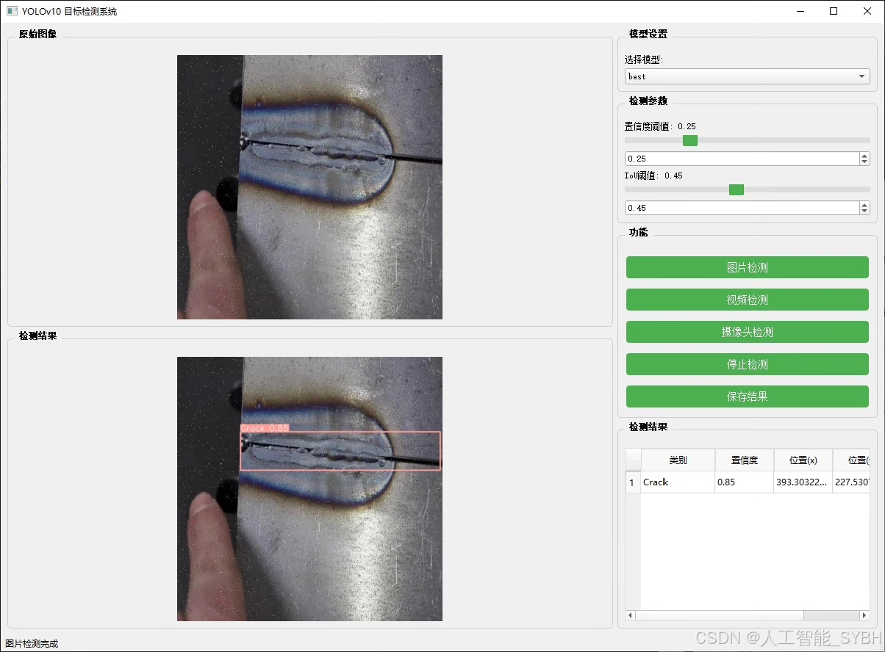
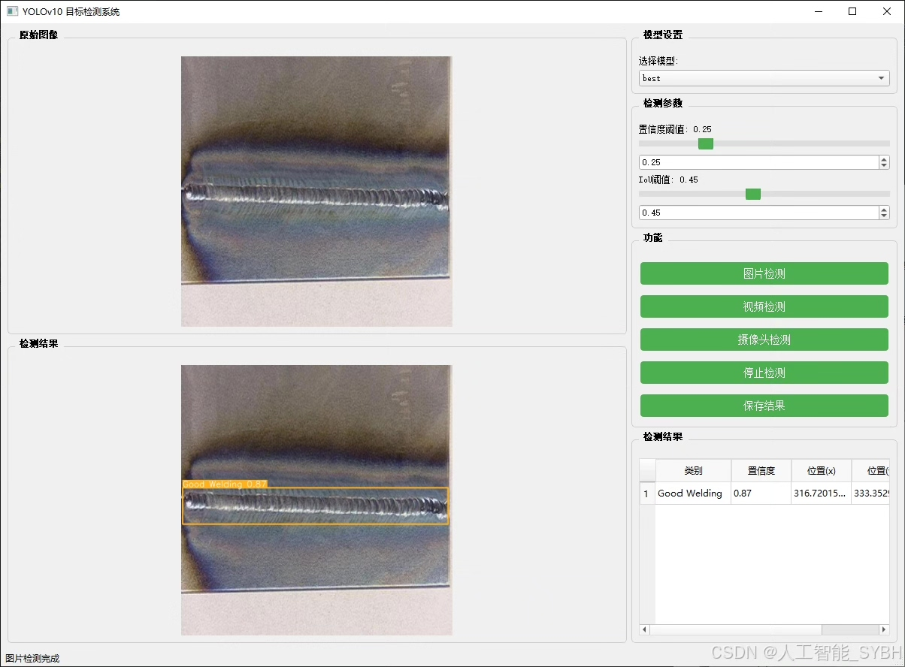
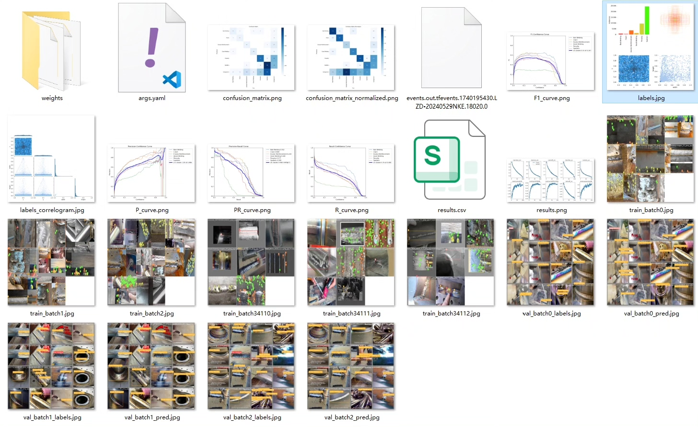
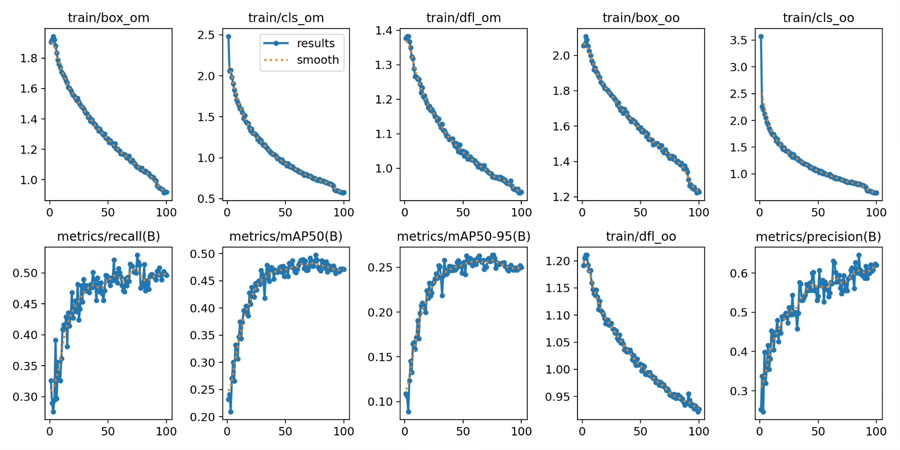
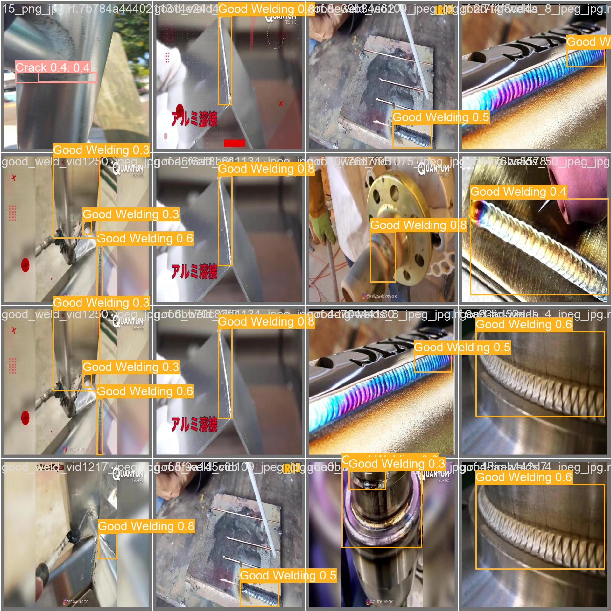
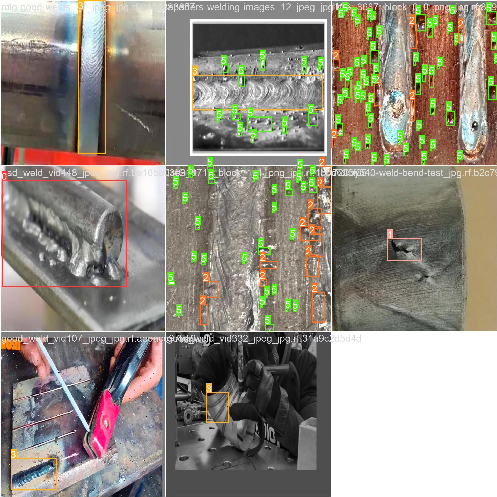

# Steel Welding Defect Detection System Based on Deep Learning YOLOv10

## Body

Based on the deep learning YOLOv10, a steel welding defect detection system (YOLOv10+YOLO dataset + UI interface + Python project source code + model)

Steel is widely used in industrial production, and its quality directly affects the safety and durability of engineering structures. During the manufacturing and welding processes, various defects such as cracks, porosities, and weld spatter can easily occur. Traditional defect detection methods mainly rely on manual inspection or specialized equipment, which are inefficient and costly. With the development of computer vision and deep learning technology, image-based target detection methods have gradually become a hot research topic in steel defect detection. The YOLO (You Only Look Once) series algorithms, due to their efficiency and accuracy, have been widely applied in the field of target detection. This project aims to develop a system capable of automatically detecting steel defects based on the YOLOv10 model, helping industrial departments improve detection efficiency and product quality.

Our company's products have obtained the official commercial license certification from YOLO.

We provide after-sales service.

After payment, we will provide WeChat ID for any questions you may have.

Environmental configuration: We will provide an instructional tutorial for setting up the environment, and WeChat will provide answers to your questions.

Remote installation services: If you need remote configuration, an additional fee of 69 is required.
If the configuration fails, all fees will be refunded (for particularly old computers, only the installation fee will be refunded).

Retraining datasets: After setting up the environment, you can train on your own computer.
If you need us to retrain, just pay 69 plus computing power fees (2.5 yuan/hour).

Full package of after-sales service

## Images

## Payment

Here is a pay link on Stripe ( https://buy.stripe.com/3cs8yP7sY87d0vu9AB ). Please contact me lonlonago@foxmail.com after funding $89, and I will send you a complete data files , thank you!

